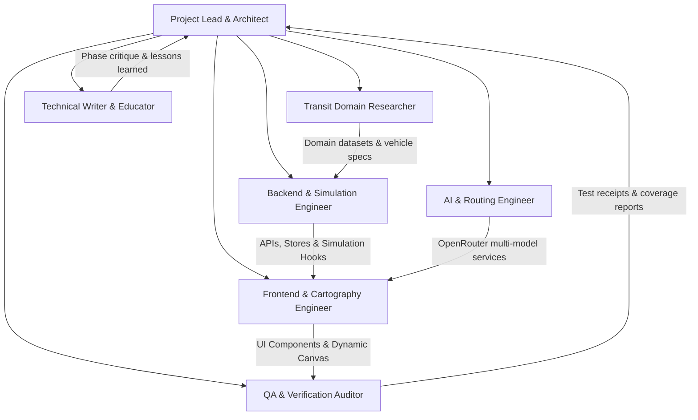

# PlatformI: Team Roles, Responsibilities & Delegation Structure

This document outlines the specialized team delegation framework for the **PlatformI** multi-agent development workflow.

---

## 1. Team Organization Matrix

---

## 2. Detailed Role Definitions & Deliverables

### 1. Lead Architect & Orchestrator
- **Role**: Coordinates inter-agent workflows, verifies interface boundaries between subsystems, and enforces strict architecture standards.
- **Responsibilities**:
  - Maintain active codebase hygiene with **zero placeholder stubs** (`TODO`, `TBD`).
  - Enforce the **zero emoji policy** (ensuring all iconography uses crisp Lucide React SVGs).
  - Track progress across all phases in `CHECKLIST.md`.

### 2. Transit Domain Researcher
- **Role**: Validates real-world public transit taxonomy, routes, hub interconnections, and enthusiast-grade vehicle specifications.
- **Responsibilities**:
  - Define authentic metadata for Jakarta & Bodetabek networks: Land (MRT, LRT Jabodebek/Jakarta, KRL Commuter Line, Whoosh HSR, KAI Bandara), Buses (TransJakarta BRT Corridors 1-14, Non-BRT, MikroTrans JAK.10, AKAP Terminals, Executive Shuttles/HiAce pool-to-pool), Air (CGK, HLP), and Maritime (Speedboats, Tanjung Priok PELNI).
  - Research coachbuilders (*Karoseri Laksana, Adiputro, Tentrem, Baze*) and chassis specifications (*Scania K310IB, Mercedes-Benz OH 1626, BYD B12, CRRC CR400AF, Toyota HiAce Premio*).
  - Model intermodal transfer pathways (e.g. JPM Dukuh Atas, CSW circular skybridge, Halim indoor walkway).

### 3. Backend & Simulation Engineer
- **Role**: Develops database persistence, vector movement simulation, and fare calculation engines.
- **Responsibilities**:
  - Implement Prisma schema models (`Region`, `TransitLine`, `StopStation`, `VehicleFleet`, `VehicleGallery`, `DisruptionAlert`, `TicketBooking`, `CheckIn`).
  - Build real-time vector movement interpolation (`useTransitSimulation.ts`) with dynamic spherical bearing and ETA calculations.
  - Implement the multi-modal fare calculator with progressive distance rates and the JakLingko 3-hour integrated tariff cap (Rp 10,000 max).
  - Build Next.js 16 Server Actions and API endpoints (`/api/crowdsource/*`, `/api/tickets/*`).

### 4. Frontend & Cartography Engineer
- **Role**: Crafts responsive, modern, glassmorphic UI presentation layers across Mobile (<640px), Tablet (640px-1024px), and Desktop (>1024px).
- **Responsibilities**:
  - Build interactive Leaflet cartography (`TransitMap.tsx`) with tile switching (Dark Matter, Voyager, Satellite, OSM), official route polylines, and directional vehicle markers.
  - Build the enthusiast vehicle inspector sheet (`VehicleDetailSheet.tsx`), interactive SVG cabin seating diagrams, and photo galleries.
  - Build the station departure/arrival boards (`HubDetailSheet.tsx`) and digital pass wallet (`DigitalPassWallet.tsx`).
  - Implement customization controls (`AppSettingsModal.tsx`) for theme, animations, and basemaps.

### 5. AI & Routing Engineer
- **Role**: Integrates multi-model OpenRouter AI services for natural language transit recommendations and disruption analysis.
- **Responsibilities**:
  - Implement OpenRouter client supporting designated models:
    - `google/gemini-3.7-flash` (Primary multi-modal advisor)
    - `google/gemini-3.5-flash-lite` (Fast query micro-agent)
    - `deepseek/deepseek-v4-pro-0813` (Deep reasoning & schedule optimization)
    - `qwen/qwen3.7-plus`
    - `openai/gpt-5.6-luna`
    - `google/gemma-4-26b-a4b-it`
  - Build `AITransitAssistantModal.tsx` allowing commuters to query optimal routes in natural language.

### 6. QA & Verification Auditor
- **Role**: Conducts continuous independent testing, boundary validation, and test suite execution.
- **Responsibilities**:
  - Write and maintain comprehensive Vitest suites (`tests/transit-system.test.ts`) covering fare calculations, simulation mathematics, QR security tokens, and crowd aggregation.
  - Audit codebase for zero placeholder stubs, type safety (`strict: true`, no `any`), and responsive rendering across viewport breakpoints.

### 7. Technical Writer & Educator
- **Role**: Authors educational guides, architectural rationale, phase critiques, and published lessons-learned.
- **Responsibilities**:
  - Write `docs/walkthrough.md` and phase-by-phase technical walkthroughs.
  - Document mathematical models (bearing angles, Haversine distance, GTFS-RT interpolation, tariff algorithms).
  - Publish lessons-learned and engineering trade-off critiques in `docs/lessons-learned/`.
